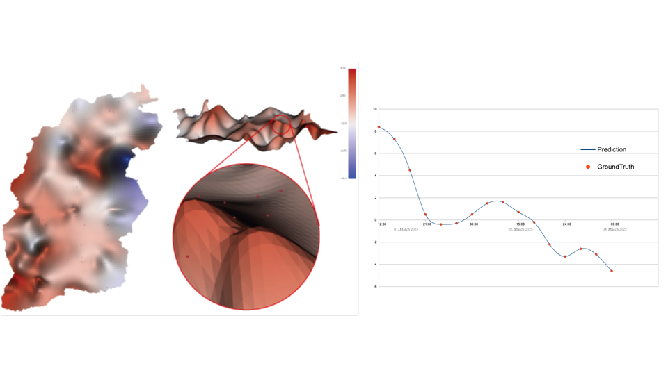
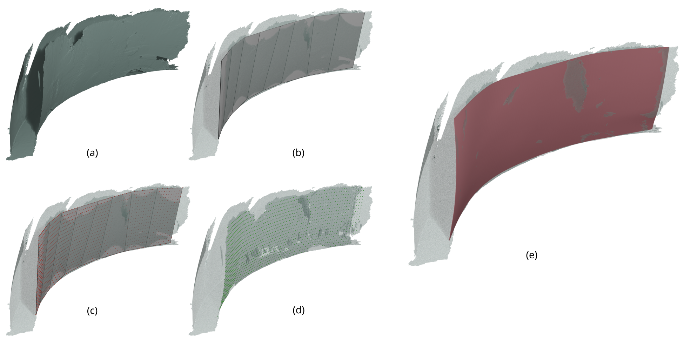

# Scattered Points Interpolation with Globally Smooth B-Spline Surface using Iterative Knot Insertion

The implementation of the paper "[Scattered Points Interpolation with Globally Smooth B-Spline Surface using Iterative Knot Insertion](https://github.com/wangbolun300/Scattered_Points_Interpolation/blob/master/fig/BSplineInterpolation-compressed.pdf)".

## Introduction
Our algorithm generates a single B-spline surface patch which interpolates the given scattered 3d data points. The inputs are the scattered 3d data points and their parametrization (in domain [0, 1] x [0, 1]). The output is the generated B-spline surface.

The advantage of our algorithm is that the input data points do not need to be distributed in rows or in grid points (like traditional interpolation methods always do), but can be scattered, and non-uniformly distributed. The generated surfaces, as they are interpolation surfaces, can often maintain a high precision in shape reconstruction, and, often use less control points, thanks to the Proposition we proposed and proved in our paper.

The code is implemented in C++, containing functions for B-spline basis calculation, knot vector generation, thin-plate energy calculation, control points solving, and, some polynomial operators(+, -, x, /, differential, integration, etc.). We also have some other interpolation/ approximation algorithms implemented in our code. We hope the code can help the users feel convenient and comfortable using B-splines. 

This code is tested on Windows and Linux, and it probably works on Mac.

## Build

Before building the code, you need to have CMake installed on your machine. To build the library and executable benchmark on Linux or macOS run:

```sh
mkdir build
cd build
cmake .. -DCMAKE_BUILD_TYPE=Release
make
```

## Usage

To interpolate scattered data points, just do:
```sh
#include <sparse_interp/Types.hpp>
```
Then, you can access the classes `Bcurve` and `Bsurface`. We have a tutorial example in `app/example.cpp` telling you how to initialize the classes, how to solve the interpolation surface, how to convert the B-spline surface into a triangular mesh, etc. You can read our paper for more details:

```bibtex
@article{Jiang:2022:Scattered,
    title        = {Scattered Points Interpolation with Globally Smooth B-Spline Surface using Iterative Knot Insertion},
    author       = {Xin Jiang and Bolun Wang and Guanying Huo and Cheng Su and Dong-Ming Yan and Zhiming Zheng},
    year         = 2022,
    journal      = {Computer-Aided Design},
    volume       = {148},
    pages        = {103244},
    issn         = {0010-4485}
}
```

In `app/test.h` we also provide you some functions for some other classical methods we implemented, including the Lofting method [Wen-Ke Wang et al, 2008, CAD], Multilevel B-spline [Seungyong Lee, et al., 1997, TVCG], Averaging method, [Piegl et al. 1996, The NURBS book] and IGA [Kineri et al. 2012, CAD]. We will continue to maintain the library, adding more methods for the users to choose (Actually, by assembling the existing functions, you can have many more traditional methods. But we will provide you the interface so that you do not need to look deep into the low-level functions).
## Examples in our paper

We provide some functions to run the results shown in our paper.

1. Benchmark models 
```bash
./Sparse_Interp_bin benchmarks delta per nbr outpath
```
where `delta` and `per` are two input parameters, ranging from 0 to 1, we recommend that `delta = 0.9` and `per = 0.5`. `nbr` is the number of sampled points, we suggest to choose a number no more than 500. `outpath` is the output path. For example, on Windows, you can run `./Sparse_Interp_bin benchmarks 0.9 0.5 100 C:\\`.


2. Mesh models 
Similarly, you can get the 2 mesh model interpolation results in the paper by running

```bash
./Sparse_Interp_bin meshes modelname outpath
```
where `modelname` choose between `mask3kf.obj` and `tiger.obj`. For example, run  `./Sparse_Interp_bin meshes mask3kf.obj C:\\`.

3. Reproduction of local non-smoothness
You can run the results of Figure 7 in the paper, by
```bash
./Sparse_Interp_bin reproduce outpath
```
It will reproduce the non-smoothness problem by inserting a lot of redundant knots into a fine surface, and reduce local energy by inserting knots to regions with large energy.

4. Fixing local non-smoothness caused by too few data points
You can run the results of Figure 7 in the paper, by
```bash
./Sparse_Interp_bin local_energy outpath
```
It will produce the results in Figure 9.

5. The Outputs of the examples

After running the code, in `outpath` there will be an interpolation surface in `.obj` format, and for each interpolation surface, there is a corresponding `.csv` file recording its runtime, maximal interpolation error, and the number of control points. After running the benchmarks, the 6 benchmark models: Peak, Drop, Hyperbolic, Sinus, Bilinear and Snail will be output into `outpath`. After running the results in Figure 7 and Figure 9, the maximal energy for each iteration will also be written into the `.csv` files.
## A temperature fitting example
We added a new example to interpolate the temperature data in Shanxi Province. You can run `./Sparse_Interp_bin temperature` to predict the temperature in Shanxi province according to the temperature data provided every 3 hours from 12:00, 01, March 2025 to 09:00, 03, March 2025 by 108 weather stations. The generated data will be saved in `Scattered_Points_Interpolation/app/meshes/`. It shows our method can be used for more complicated problems in higher dimensions.


The figure shows the temperature as a height map that precisely passes through the ground-truths (red dots). The curve plot shows the fitting results in Ningwu County of Shanxi Province.

Acknowledgment: The temperature dataset is provided by [China Meteorological Data Service Centre](https://data.cma.cn/en).
## A least square fitting example of real-world data.
You can run `./Sparse_Interp_bin strips` to test an example where we use the traditional least square method to fit a triangle mesh obtained by 3D scanning. For noisy data that does not require extremely high fitting precision, the least square fitting method is preferred, since the users can use fewer control points and user-specific weights to obtain smoother fitting results. 

In this example, we use a simple yet effective method to obtain the sampling points and their parametrization: (a) shows the input mesh obtained by a 3D scanner. To fit the surface patch that is closer to the viewer, we attach a strip-shaped quad mesh (b) to the target surface (you can use any 3D editor like Blender to do it). We sample the quad mesh (c) and project the sampling points to the surface to obtain the data points to fit (d). In this way, the parametrization of the data points can be obtained from the quad mesh, since the quad mesh provides an injection that attaches the parameters to each data point. The final B-spline fitting surface is shown in (e), where the number of control points is $30\times15$, and the weight for fairness is $0.001$, and the maximum relative fitting error is $0.0065$ of the diagonal length of the AABB of the surface.

## Contact

The code is far from being perfect, e.g. solving stability problems for large amounts of data points. If you have a problem using our code, or you have a bug to report, please contact us at `wangbolun@buaa.edu.cn`, or post an issue on GitHub. We'd appreciate to have your contribution. If you are using our code in your projects, please contact us and briefly tell us what you use it for. That will all become the motivation we maintaining the code.

## TODO
1. replace the current sparse linear system solver since it is inefficient and memory-consuming.
2. provide an interface for the classical least-square method for surface and curve interpolation.


